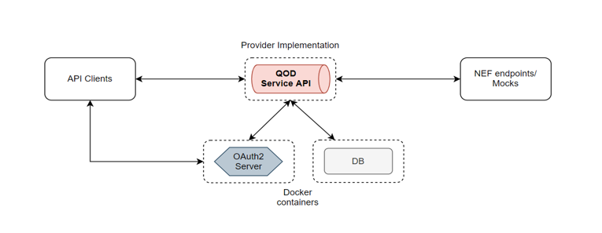

# CAMARA QoD API - Spry Fox Networks

This respository contains the CAMARA QoD API implementation written in Go Language.

## Usage

### Setup

To give a quick try, one could use a setup as shown in the picture below.



For now, the qodservice application runs on Linux based targets. The user
can use WSL2, while using Windows or use a Linux based Virtual Machine to
try out the application.

The instructions below use `docker` and `docker-compose` tools. The version of these tools used
in the setup are mentioned below:

- `docker` Engine client and server version used in the setup is v20.10.7
- `docker-compose` version used in the setup is v1.29.2

### Build (Standalone)

To build the `qodservice` application and execute it in a Docker container, follow
the below steps:

```bash
cd code/API_code/qodservice
docker build -t qodservice .
```

To verify the app executes properly, one could try the below command.

```bash
docker run qodservice
```


Note-2: Need to configure the service next to use it.

### Configure the service

The service is configurable using the `./config/qodservice_cfg.yml` YAML configuration
file. The sections are self explanatory.

To communicate with a `NEF` provider, the following sections need to be configured appropriately.

```yaml
  oauth2Client: # OAuth2 client settings (QoD's outgoing requests towards NEF) - TODO: Update according to your setup
    tokenUrl: https://URL/that/provides/accesstokens
    clientId: yourClientId # The one assigned to you by the NEF provider
    clientSecret: yourClientSecret # The one assigned to you by the NEF providers 
  nef: # TODO: Update according to your setup
    scheme: https
    serviceDomainName: nef.provider.url # The one assigned to you by the NEF provider
    serviceName: 3gpp-as-session-with-qos/v1
    suppFeatures: 0
    timeoutSecs: 10 # Http Client timeout while waiting for response
```

### Bring up the setup for dev/test

As shown in the picture, the setup uses an OAuth2 server and a DB for proper usage.
To demonstrate usage in a development environment, this section explains the bring up using
`KeyCloak` as OAuth2 and `MongoDB` as DB provider respectively.

```bash
cd code/API_code
docker-compose -f resources/docker/bringup.yml up
```

This should bring up the necessary containers - `qodservice`, `keycloak`, `mongodb` and have them
configured in a separate docker network.

Any `qodclient` in the form of curl/Postman/app can use the service accordingly.
